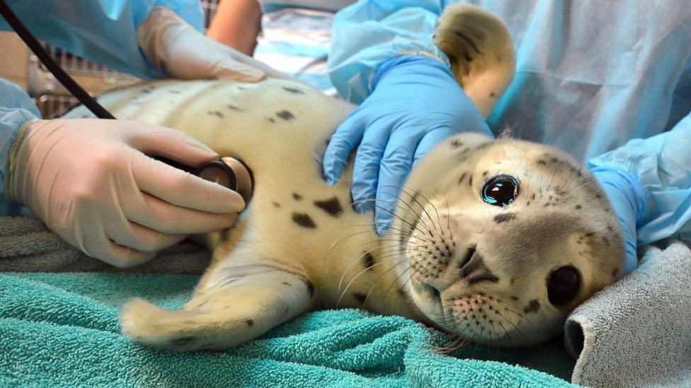

# Marine Mammal Rescue Centre 

## Market research survey and analysis

This research is part of final project of Market Research discipline of UBC Diploma in Marketing and Sales Management. 

We are 4 (myself included) students of UBC doing a market research on behalf of Marine Mammal Rescue Centre. 
The Data Analysis presented in this repo is only based on my  personal analysis. 

The purpose of this survey is to better understand public knowledge of marine mammals and public support of charitable causes.

## Methodology

We conducted a survey with the general public and MMR supporters. 
Data collection was completed through a mix of online surveys and personal intercept surveys. 

The sampling technique we employed is judgement sampling. We selected this sampling technique based on discussions with MMR staff, who identified groups that they would like us to target as our sampling frame. For our surveys, we approached anyone who is willing to take the survey that falls within our sampling frame criteria.
To reach our sample we employed three methods:
1) An online survey link was sent out through MMR’s volunteer network newsletter requesting participation. 
2) The researchers conducted intercept surveys targeting guests exiting the aquarium and locals and tourists at Stanley Park and the Seawall. People who agreed to participate in the survey submitted their responses on a tablet.
3) An online survey link was distributed through the researchers’ personal and professional networks.
Our total sample size was 171 participants and we used 139 responses for our analysis. 32 responses were excluded due to the respondent skipping too many questions. The sample is slightly smaller than our initial target of 200 due to COVID-19 restrictions. 

